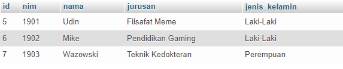

## TP3DPBO2022

Janji

>Saya Nelly Joy Christi Simanjuntak 2000199 mengerjakan TP3 dalam mata kuliah Desain dan Pemrograman Berorientasi Objek untuk keberkahanNya maka saya tidak melakukan kecurangan seperti yang telah dispesifikasikan. Aamiin

#### TP3 - Python GUI
Pada tugas ini terdapat source code Python yang telah diperbaiki fiturnya. Pada folder program_code terdapat file python dan folder project yang berisi kumpulan gambar. Pada folder database terdapat file sql yang merupakan database yang digunakan. Berikut penjelasan mengenai apa yang telah saya kerjakan beserta dokumentasi hasilnya.

1. Menambahkan field jenis kelamin pada database dengan tipe inputan radio button
   >Jenis kelamin yang telah ditambahkan pada database
   >

   >Jenis kelamin pada form dengan metode input radio button  
   >

2. Menambahkan data hobi pada form dengan tipe inputan combo box
   >Data hobi yang telah ditambahkan pada database
   >

   >Data hobi yang inputannya bertipe combo box pada form. Combo box dapat digunakan dengan memilih pilihan pada dropdown atau mengetikkannya pada field.  
   >

3. Input data mahasiswa yang telah berjalan.
   >

4. Hapus semua data mahasiswa yang telah berjalan
   >

5. Button untuk menampilkan gambar daftar fasilitas kampus.
   >

   

###### Sekian tugas saya, mohon maaf apabila masih terdapat banyak kesalahan atau kekurangan. Terima kasih.
